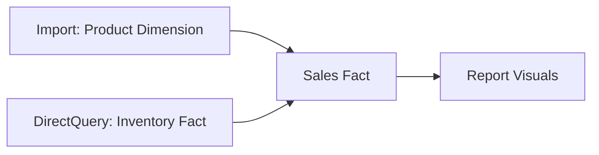

## **1. RLS Implementation**  

**Static vs Dynamic RLS:**  

```dax  
// Static RLS (hard-coded values)  
[Region] = "North"  

// Dynamic RLS (user-based)  
[Region] = LOOKUPVALUE(  
    UserSecurity[Region],  
    UserSecurity[Email],  
    USERPRINCIPALNAME()  
)  
```  

> [!IMPORTANT]  
> **Key Difference**: Static RLS uses fixed values, while dynamic RLS references user attributes from a security table.  

---

## **2. Historical Data Handling**  

**Solutions for Historical Analysis**:  

1. **Temporal Tables** in SQL Server  
2. **Slowly Changing Dimensions** (Type 2)  
3. **Power Query Incremental Refresh**:  

```m  
// In Power Query parameters  
RangeStart = #datetime(2023,1,1,0,0,0)  
RangeEnd = #datetime(2023,12,31,23,59,59)  
```  

> [!TIP]  
> Incremental Refresh is ideal for large datasets to optimize refresh performance.  

---

## **3. Multi-Fact Table Drill-Through**  

**Workaround Solution**:  

```dax  
// Create bridge measure  
Drill Measure =  
SWITCH(  
    SELECTEDVALUE(DrillType[Type]),  
    "Sales", [Sales Amount],  
    "Inventory", [Stock Count],  
    "Orders", [Order Quantity]  
)  
```  

> [!NOTE]  
> Use a dedicated drill-through page with bookmarks to show different fact table perspectives.  

---

## **4. Constraint Impacts**  

**Primary Key Violation Scenario**:  
- Source table: `Product[ID]` (PK)  
- Power BI model: `Sales[ProductID]` (FK)  
- If source PK constraints are removed, Power BI will:  
  - Show many-to-many relationship warnings  
  - Require `CROSSFILTER()` to enforce filtering  

> [!WARNING]  
> Ensure proper constraints in the source system to avoid data integrity issues.  

---

## **5. License Identification Chart**  

| **Icon** | **License Type** | **Key Limits**                     |  
|----------|------------------|------------------------------------|  
| 💎       | Premium          | 400GB models, 100TB storage        |  
| 👤+💎    | PPU              | 100GB models, 10TB storage         |  
| 🆓       | Free             | 1GB models, 10GB storage           |  

> [!TIP]  
> Premium licenses offer higher capacity and advanced features like incremental refresh.  

---

## **6. Unit Testing Framework**  

**Validation Process**:  

1. **SQL Verification Query**:  
   ```sql  
   SELECT COUNT(*) FROM fact_sales  
   WHERE sales_date BETWEEN '2023-01-01' AND '2023-12-31'  
   -- Expected: 45,678 records  
   ```  

2. **Power BI Test Measure**:  
   ```dax  
   Test Record Count =  
   CALCULATE(  
       COUNTROWS(Sales),  
       Sales[Date] IN {DATE(2023,1,1)..DATE(2023,12,31)}  
   )  
   // Should return 45,678  
   ```  

> [!IMPORTANT]  
> Always validate against a trusted source to ensure accuracy.  

---

## **7. Automation Techniques**  

**Power Automate Integration Example**:  
- **Trigger**: When a Power BI dataset refreshes  
- **Actions**:  
  1. Export PDF report  
  2. Email to stakeholders  
  3. Post notification to Teams channel  

> [!TIP]  
> Automate repetitive tasks to save time and reduce errors.  

---

## **8. Dual Mode Implementation**  

**Composite Model Example**:  


> [!NOTE]  
> Set in Model View → Storage Mode.  

---

## **9. Data Verification Methodology**  

**Three-Way Validation Process**:  
1. Source System Counts  
2. Power Query Transformations  
3. Final Model Output  

**DAX Validation Measure**:  
```dax  
Data Variance =  
VAR SourceCount = [SQL Row Count]  
VAR PBIcount = COUNTROWS(FactTable)  
RETURN DIVIDE(PBIcount, SourceCount, 0) - 1  
// Acceptable variance < 0.1%  
```  

> [!IMPORTANT]  
> Validate at multiple stages to ensure data integrity.  

---

## **10. Advanced Testing Approach**  

**Parameterized Testing Framework**:  
```m  
// Test Query  
let  
    Source = Sql.Database(...),  
    TestResult = if Table.RowCount(Source) = ExpectedCount  
        then "Pass" else "Fail"  
in  
    TestResult  
```  

> [!TIP]  
> Use parameterized tests for repeatable and scalable validation.  

---

### **1. Can we use `USERNAME()` and `USERPRINCIPALNAME()` in static RLS?**  

**Answer**:  
No, these functions are used exclusively for **Dynamic RLS**. Static RLS uses hard-coded values, while Dynamic RLS relies on these functions to fetch user-specific information.  

> [!IMPORTANT]  
> `USERPRINCIPALNAME()` is the recommended function for Dynamic RLS in Power BI Service.  

---

### **2. Does Power BI maintain/store historical data and how?**  

**Answer**:  
Power BI itself does not automatically maintain historical data. However, you can achieve this through:  
1. **Source System**: Use Slowly Changing Dimensions (SCD Type 2) in the source database.  
2. **Incremental Refresh**: Configure in Power BI to accumulate historical data over time.  

> [!TIP]  
> Always manage history at the source for reliability.  

---

### **3. Is it possible to create drill-down and drill-up on 3 fact tables?**  

**Answer**:  
Yes, by using **conformed dimensions** shared across fact tables. This allows filtering to propagate across facts, creating a seamless drill-down experience.  

> [!NOTE]  
> Ensure all fact tables share common dimensions for this to work.  

---

### **4. If there are constraints applied on a table, does the Primary Key and Foreign Key affect in Power BI?**  

**Answer**:  
No, Power BI does not enforce source database constraints. Relationships in Power BI are managed independently, though constraints can help Power BI detect relationships automatically.  

> [!WARNING]  
> Always define relationships explicitly in Power BI, regardless of source constraints.  

---

### **5. If we are taking data from a DB where a table has 6k rows, and then the table gets truncated and now has only 1k rows, will Power BI still have all the 6k rows from the table after a refresh?**  

**Answer**:  
No. A standard refresh in Import mode replaces all data, so Power BI will only have the 1k rows after the refresh.  

> [!IMPORTANT]  
> Use Incremental Refresh to preserve historical data.  

---

### **6. How will you identify the type of license by looking at a workspace?**  

**Answer**:  
- **Premium**: Workspace has a diamond icon.  
- **Pro/Shared**: No diamond icon.  

> [!TIP]  
> Check the workspace icon to quickly identify the license type.  

---

### **7. What is the size of a workspace?**  

**Answer**:  
- **Pro**: 10 GB per user, 1 GB per dataset.  
- **Premium**: Up to 100 TB (SKU-dependent).  

> [!NOTE]  
> Use DAX Studio or admin tools to check current dataset sizes.  

---

### **8. What is unit testing in Power BI?**  

**Answer**:  
Testing individual components (measures, queries, relationships) to ensure they work as expected.  

> [!TIP]  
> Validate each component independently before integrating into the full report.  

---

### **9. Do you do report validation? How do you do that?**  

**Answer**:  
Yes, by cross-verifying against a trusted source (e.g., SQL queries, existing reports).  

> [!IMPORTANT]  
> Always validate against an independent source, not the report itself.  

---

### **10. How will you cross-verify the data which is coming from the data source to the report?**  

**Answer**:  
Use SQL queries, compare with existing reports, or export data for manual verification.  

> [!TIP]  
> Automate validation where possible using DAX or Power Automate.  

---

### **11. Did you do any automation?**  

**Answer**:  
Yes, including:  
- Scheduled refreshes  
- Power Automate workflows  
- PowerShell scripts for deployment  

> [!NOTE]  
> Automation improves efficiency and reduces errors.  

---

### **12. What is dual mode?**  

**Answer**:  
A storage mode in composite models where a table can act as either Import or DirectQuery depending on the query context.  

> [!TIP]  
> Use Dual mode for dimension tables in mixed storage models to optimize performance.  

---

This document provides comprehensive solutions to advanced Power BI topics, ensuring clarity and depth for technical interviews and real-world applications.  

> [!TIP]  
> Practice these concepts with sample datasets to reinforce your understanding and prepare for interview scenarios.  
