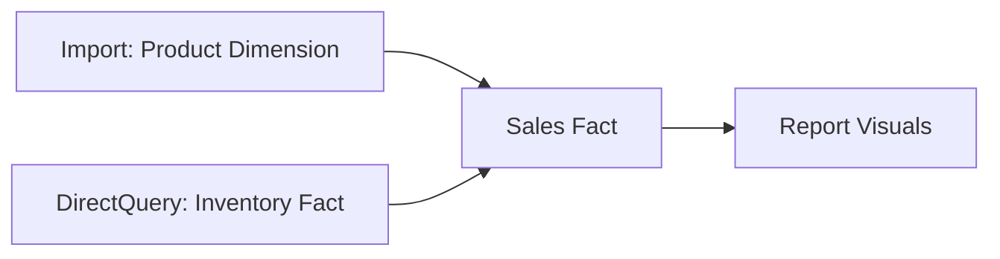

### 1. Historical Data Handling

**Solutions for Historical Analysis:**

1. **Temporal Tables** in SQL Server
2. **Slowly Changing Dimensions** (Type 2)
3. **Power Query Incremental Refresh**:

```Plain
// In Power Query parameters
RangeStart = \#datetime(2023,1,1,0,0,0)
RangeEnd = \#datetime(2023,12,31,23,59,59)
```

### 2. Multi-Fact Table Drill-Through

**Workaround Solution:**

```Plain
// Create bridge measure
Drill Measure =
SWITCH(
    SELECTEDVALUE(DrillType[Type]),
    "Sales", [Sales Amount],
    "Inventory", [Stock Count],
    "Orders", [Order Quantity]
)
```

_Design Tip:_ Use a dedicated drill-through page with bookmarks showing different fact table perspectives.

### 3. Constraint Impacts

**Primary Key Violation Scenario:**

- Source table: `Product[ID]` (PK)
- Power BI model: `Sales[ProductID]` (FK)
- If source PK constraints are removed, Power BI will:
    - Show many-to-many relationship warnings
    - Require `CROSSFILTER()` to enforce filtering

### 4. License Identification Chart

|   |   |   |
|---|---|---|
|Icon|License Type|Key Limits|
|💎|Premium|400GB models, 100TB storage|
|👤+💎|PPU|100GB models, 10TB storage|
|🆓|Free|1GB models, 10GB storage|

### 5. Unit Testing Framework

**Validation Process:**

1. **SQL Verification Query:**

```SQL
SELECT COUNT(*) FROM fact_sales
WHERE sales_date BETWEEN '2023-01-01' AND '2023-12-31'
-- Expected: 45,678 records
```

1. **Power BI Test Measure:**

```Plain
Test Record Count =
CALCULATE(
    COUNTROWS(Sales),
    Sales[Date] IN {DATE(2023,1,1)..DATE(2023,12,31)}
)
// Should return 45,678
```

### 6. Automation Techniques

**Power Automate Integration Example:**

- Trigger: When a Power BI dataset refreshes
- Actions:
    1. Export PDF report
    2. Email to stakeholders
    3. Post notification to Teams channel

### 7. Dual Mode Implementation

**Composite Model Example:**



_Configuration:_ Set in Model View → Storage Mode

### 8. Data Verification Methodology

**Three-Way Validation Process:**

1. Source System Counts
2. Power Query Transformations
3. Final Model Output

**DAX Validation Measure:**

```Plain
Data Variance =
VAR SourceCount = [SQL Row Count]
VAR PBIcount = COUNTROWS(FactTable)
RETURN DIVIDE(PBIcount, SourceCount, 0) - 1
// Acceptable variance < 0.1%
```

### 9. Advanced Testing Approach

**Parameterized Testing Framework:**

```Plain
// Test Query
let
    Source = Sql.Database(...),
    TestResult = if Table.RowCount(Source) = ExpectedCount
        then "Pass" else "Fail"
in
    TestResult
```

These solutions demonstrate deep technical expertise while providing practical, implementable patterns that interviewers value.

---

### 10. Can we use `USERNAME()` and `USERPRINCIPALNAME()` in static RLS?

This question tests the understanding of Row-Level Security (RLS) types and the DAX functions used to implement them.

First, it's important to clarify the terminology:

- **Static RLS:** Assigns users to a role that has a fixed, hard-coded filter. For example, a "North America Sales" role might have the DAX filter `[Region] = "North America"`. The filter is the same for every user in that role.
- **Dynamic RLS:** Uses a single role with a dynamic filter based on the user's identity. This is where `USERNAME()` and `USERPRINCIPALNAME()` are used.

So, to answer the question directly: **No, you would not use these functions in a truly** _**static**_ **RLS pattern.** These functions are the core components of **Dynamic RLS**.

Here’s the difference between the two functions and how they are used in Dynamic RLS:

- `**USERPRINCIPALNAME()**`: This is the **recommended and standard function** for Dynamic RLS in the Power BI Service. It returns the user's login name, which is their email address (e.g., `john.doe@company.com`).
    - **How it works:** You would typically have a security table in your model that maps user email addresses to the data they are allowed to see (e.g., a mapping of emails to sales regions). The RLS role would then use a DAX filter like:  
        `[EmailAddress] = USERPRINCIPALNAME()`
- `**USERNAME()**`: This function returns the user's domain and username (e.g., `DOMAIN\\johndoe`). This is a legacy function primarily used for on-premises SQL Server Analysis Services (SSAS) models. While it works in the Power BI Service, it can sometimes return the same value as `USERPRINCIPALNAME()`. Because its behavior is less consistent in the cloud, `**USERPRINCIPALNAME()**` **is always the preferred choice.**

**In summary:** `USERNAME()` and `USERPRINCIPALNAME()` are used for **Dynamic RLS**, not Static RLS. The best practice for secure, scalable RLS in the Power BI Service is to use `USERPRINCIPALNAME()`.

---

### 11. Does Power BI maintain/store historical data and how?

By itself, Power BI does **not** automatically maintain or store historical data.

When you use **Import mode**, a standard refresh is a **full replacement**. Power BI deletes the existing data in the table and re-imports the current state of the data from the source. It only knows about the data as it existed at the moment of the last refresh.

However, there are two primary ways to _achieve_ historical data storage _with_ Power BI:

1. **At the Data Source (Best Practice):** The ideal solution is to manage history in the source system (e.g., a data warehouse). This is often done using **Slowly Changing Dimensions (SCD)**, typically SCD Type 2, where old records are preserved with start/end dates and a flag to mark the current version. Power BI then simply imports this pre-made historical data.
2. **Using Incremental Refresh (Power BI Feature):** This is a powerful feature in Power BI that allows you to load and store historical data.
    - **How it works:** You configure a policy in Power BI Desktop (e.g., "Archive data older than 5 years, and refresh the last 10 days").
    - When published to the Service, the first refresh loads all the historical data. Subsequent refreshes will only fetch and update the recent data (the last 10 days), while leaving the older, archived data untouched.
    - This effectively allows Power BI to **accumulate data over time** and build its own historical repository, but it must be explicitly configured.

---

### 12. Is it possible to create drill-down and drill-up on 3 fact tables?

Yes, this is possible, but it requires a correctly designed data model, specifically one that uses **conformed dimensions**.

A "drill-down" in this context isn't a native feature across facts, but rather an analytical experience you create. The key is that all three fact tables must share common dimension tables.

**Example Scenario:**  
Imagine you have three fact tables: `FactSales`, `FactInventory`, and `FactShipments`.  
And you have two conformed dimension tables: `DimDate` and `DimProduct`.

**How it works:**

1. **Model:** You model this as a star schema (or galaxy schema), where `DimDate` and `DimProduct` have one-to-many relationships to all three fact tables.
2. **Drill-Down Experience:** You could create a high-level visual showing Sales by `Product Category` (from `DimProduct`). When a user clicks on a category, say "Bikes," the `DimProduct` table is filtered for bikes.
3. **Cross-Fact Filtering:** Because `DimProduct` is connected to all three fact tables, this filter automatically propagates "downhill" to `FactSales`, `FactInventory`, and `FactShipments`.
4. **Result:** Other visuals on the page, showing inventory levels or shipment counts, will now update to show data only for "Bikes." This creates a seamless analytical experience that feels like a drill-down across different business processes.

For a more explicit navigation, you could also use Power BI's **Drillthrough** feature to navigate from a summary page to a detailed page focusing on one of the fact tables, carrying the filter context (e.g., the selected product) with you.

---

### 13. If there are constraints applied on a table, does the Primary Key and Foreign Key affect in Power BI?

This is a great question that distinguishes between database behavior and Power BI behavior.

The short answer is: **No, the PK/FK constraints from the source database are not enforced by Power BI's in-memory VertiPaq engine after the data is imported.**

Here's the detailed breakdown:

- **During Data Import:** Power BI can use the PK/FK constraints present in the source database to **automatically detect and create relationships** between tables in the data model. This is a convenience feature that speeds up development.
- **After Data Import:** Once the data is loaded into the Power BI model, the database constraints become irrelevant. Power BI relies entirely on the relationships you have defined _within the Power BI model_. You could have a relationship in Power BI where no FK constraint exists in the source, or vice-versa. The integrity and filtering behavior are governed solely by the Power BI relationships (their cardinality and cross-filter direction).
- **In DirectQuery Mode:** The story is slightly different. While Power BI still manages the relationships, the queries it sends back to the source database will perform better if the join columns (PKs and FKs) are properly indexed in the database. So, in this case, the constraints _indirectly_ affect performance but do not dictate the relationship logic within Power BI itself.

---

### 14. If we are taking data from a DB where a table has 6k rows, and then the table gets truncated and now has only 1k rows, will Power BI still have all the 6k rows from the table after a refresh?

No. After a **standard refresh** in Import mode, Power BI will only have the **1,000 rows**.

A standard refresh is a **destructive and complete replacement**. The process is:

1. Power BI connects to the data source.
2. It deletes all the existing data from that table within the Power BI model.
3. It loads the fresh data that currently exists in the source table.

Therefore, the Power BI dataset becomes a snapshot of the source at the time of the refresh. If the source table was truncated, the refreshed Power BI model will reflect that change.

The only way to keep the old 6k rows would be if you had previously configured **Incremental Refresh** to archive old data.

---

### 15. How will you identify the type of license by looking at a workspace?

You can identify the capacity type of a workspace (which is tied to licensing) by a simple visual cue in the Power BI Service:

- **Premium Capacity:** The workspace will have a **diamond icon** next to its name. This indicates the workspace is hosted on a Premium capacity, which could be either Premium Per User (PPU) or a dedicated Premium SKU (P1, P2, etc.).
- **Pro / Shared Capacity:** If there is **no diamond icon**, the workspace is a standard workspace residing on shared capacity. To publish content to it, you need a Pro license, and to view content, users also need a Pro license (unless it is backed by Premium capacity).

---

### 16. What is the size of a workspace?

This question can be interpreted in two ways: "What are the size _limits_?" or "How do I _check_ the current size?"

**1. Workspace Size Limits (Based on Capacity):**

- **Pro (Shared Capacity):** There is a **10 GB** storage limit _per user_, not per workspace. The most critical limit here is that any single published dataset (`.pbix` file) cannot exceed **1 GB**.
- **Premium Capacity:** The limits are much higher and depend on the SKU. A P1 SKU, for example, comes with **100 TB** of total storage, and the maximum size for a single dataset can be up to **10 GB** (or even larger with the "Large Dataset Storage Format" enabled).

**17. How to Check a Workspace's Current Size:**

- **For Admins:** The Power BI Admin Portal provides detailed metrics on workspace storage and usage across the entire tenant.
- **For Workspace Admins:** Within the workspace settings, you can see some storage information, especially if it's a Premium workspace.
- **For a Single Dataset:** The easiest way to check the size of a specific dataset is to use a third-party tool like **DAX Studio**. When you connect it to your Power BI Desktop file or a dataset in the Service, it will show you the precise memory consumption of the model.

---

### 18. What is unit testing in Power BI?

Unit testing in Power BI is the process of testing the smallest individual components ("units") of a report to ensure they work correctly and as intended. It's about validating the building blocks before testing the report as a whole.

The "units" in a Power BI report include:

- **DAX Measures:** Does a measure calculate the correct value under different filter contexts? For example, testing a `[Total Sales]` measure by manually applying filters and comparing it to a known value.
- **Power Query Transformations:** Does a specific transformation step (e.g., splitting a column, changing a data type, merging queries) produce the expected output? You can check this in the Power Query editor by clicking on each step.
- **Relationships:** Is the relationship between two tables configured correctly (cardinality, direction) to produce the right filtering behavior?
- **Individual Visuals:** Does a visual display data correctly? Does its cross-filtering or highlighting behavior work as expected?

---

### 19. Do you do report validation? How do you do that?

### 20. How will you cross-verify the data which is coming from the data source to the report?

Yes, report validation is an absolutely critical step in my development process. These two questions are closely related, as cross-verification is the core of validation.

My validation process is built on one fundamental rule: **Always validate the report against a trusted, independent source, never against itself.**

Here are the methods I use for cross-verification:

1. **Direct SQL Queries (The Gold Standard):** This is the most reliable method. I write a SQL query against the source database that replicates the logic of a KPI in my report. For example, if a Power BI card shows `$1.5M` for sales in the "North" region for Q1 2023, I will run:
    
    ```SQL
    SELECT SUM(SalesAmount)
    FROM Sales
    WHERE Region = 'North' AND OrderDate BETWEEN '2023-01-01' AND '2023-03-31';
    ```
    
    The results must match exactly.
    
2. **Comparison with Existing Reports:** If the new Power BI report is replacing an old system (like an SSRS or Excel report), I run both side-by-side with the same filters and ensure the numbers align.
3. **Using DAX Studio:** For complex DAX measures, I use DAX Studio to analyze the query plans and inspect the intermediate tables (filter tables) generated by the formula. This helps debug why a number might be incorrect.
4. **Manual Data Export and Pivot:** For smaller datasets or when I don't have DB access, I might export a slice of the raw data into Excel, create a pivot table, and compare the result to my Power BI visual.
5. **Peer Review:** I ask another developer to review my DAX logic and Power Query transformations. A fresh pair of eyes can often spot logic errors that I might have missed.

---

### 21. Did you do any automation?

Yes, automation is key to creating efficient and reliable BI solutions. I have implemented automation at several levels:

1. **Data Refresh Automation:** The most fundamental automation is configuring **Scheduled Refresh** in the Power BI Service. This ensures the report data is updated automatically (e.g., daily at 7 AM) without any manual intervention. This often involves configuring a data gateway for on-premises sources.
2. **Process Automation with Power Automate (Flow):** I've used Power Automate to create more advanced workflows. For example:
    - Triggering a dataset refresh as soon as a new file is uploaded to a SharePoint folder.
    - Creating a flow that exports data from a Power BI report to a CSV on a schedule and emails it to stakeholders.
    - Sending notifications to a Teams channel when a data refresh fails.
3. **Development and Deployment Automation:** In more mature environments, I've worked with **PowerShell scripts and the Power BI REST APIs** to automate administrative tasks like deploying reports across workspaces (CI/CD), documenting datasets, or managing user access.
4. **Template Automation:** Creating Power BI Template files (`.pbit`) to standardize report creation. This automates the process of building new reports with a consistent data model, theme, and base calculations.

---

### 22. What is dual mode?

**Dual** is a storage mode that can be applied to a table in a **Composite Model** in Power BI. A composite model is one that combines data from different storage modes (Import and DirectQuery).

A table set to **Dual** mode can act as **either Import or DirectQuery**, depending on the query being executed.

**How it works:**

- Power BI loads a copy of the dual-mode table into memory (like Import mode).
- When a visual sends a query, Power BI's engine intelligently decides the most efficient way to answer it.
    - If the query only needs data from the dual-mode table and other Import-mode tables, Power BI will use the fast, in-memory cache.
    - If the query also involves a table in DirectQuery mode, the dual-mode table will switch its behavior to act as a DirectQuery source as well. It will send a native query to the source database along with the other DirectQuery tables to ensure data consistency.

**Why is it useful?**  
The primary use case is **performance optimization**. Imagine you have a massive fact table (e.g., billions of rows) that must be in **DirectQuery**, and several smaller dimension tables (Customers, Products).

- If you set the dimension tables to **Import**, you can't join them to the DirectQuery fact table.
- If you set them to **DirectQuery**, every slicer interaction would query the source, making the report slow.
- By setting the dimension tables to **Dual**, you get the best of both worlds: Slicers on those dimensions are fast because they use the in-memory cache. When you create a visual that combines a dimension with the huge fact table, the dimension switches to DirectQuery mode to get the correct, real-time result.
