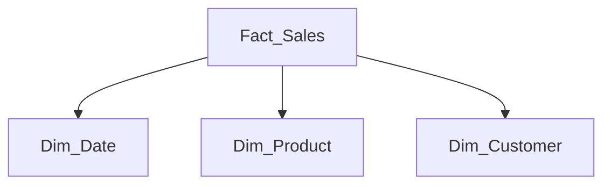
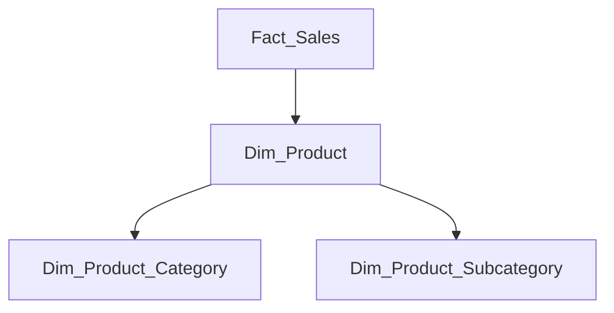
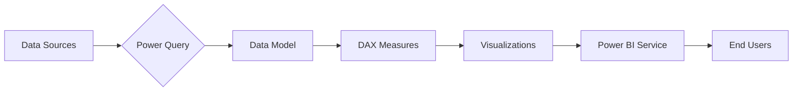

### **Power BI Interview Questions & Expert Answers**

---

### **1. Calculated Columns vs Measures**

|   |   |   |
|---|---|---|
|Feature|Calculated Columns|Measures|
|**Context**|Row context|Filter context|
|**Storage**|Consumes memory|Calculated at runtime|
|**Usage**|Relationships, row-level ops|Aggregations, KPIs|
|**Refresh**|Requires data refresh|Dynamic calculation|

**Pro Tip:** Use measures for 90% of calculations to optimize performance.

---

### **2. Power BI Performance Optimization**

**Top 5 Optimization Techniques:**

1. **Data Model**
    - Implement star schema
    - Remove unused columns (`Home > Remove Columns`)
    - Set proper data types (avoid "Any" type)
2. **DAX Best Practices**
    
    ```Plain
    -- Good
    Sales = SUMX(FILTER(Sales, Sales[Amount] > 100), Sales[Amount])
    
    -- Better (uses variables)
    Sales =
    VAR FilteredSales = FILTER(Sales, Sales[Amount] > 100)
    RETURN SUMX(FilteredSales, Sales[Amount])
    ```
    
3. **Query Optimization**
    - Enable query folding in Power Query
    - Limit rows with `Table.FirstN()`
    - Disable auto date/time tables
4. **Visualization**
    - Limit visuals per page (<10 recommended)
    - Use bookmarks for complex interactions
5. **Deployment**
    - Use incremental refresh for large datasets
    - Schedule off-peak refreshes

---

### **3. Relationship Types Deep Dive**

**One-to-Many (Most Common)**

- Fact table (many) → Dimension table (one)
- Cross-filter: Single direction (recommended)

**Many-to-Many (Caution Required)**

- Requires bridge tables
- Use `CROSSFILTER()` for controlled filtering

**Bi-directional (Use Sparingly)**

- Impacts performance
- Alternative: Use DAX measures with `USERELATIONSHIP()`

---

### **4. Filter Types & Best Practices**

|   |   |   |
|---|---|---|
|Filter Type|Scope|Use Case|
|Visual-level|Single visual|Custom visual filtering|
|Page-level|All visuals on page|Page-specific filters|
|Report-level|Entire report|Global filters|
|Drill-through|Target page|Contextual navigation|
|Slicers|User-controlled|Interactive filtering|

**Pro Tip:** Use `KEEPFILTERS()` in measures to preserve existing filters.

---

### **5. Star vs Snowflake Schema**

**Star Schema (Recommended)**



**Snowflake Schema (When Necessary)**



**Key Difference:** Normalization level (snowflake normalizes dimensions)

---

### **6. Security Implementation**

**Row-Level Security (RLS) Types:**

1. **Static RLS**
    
    ```Plain
    [Region] = USERNAME()
    ```
    
2. **Dynamic RLS**
    
    ```Plain
    [Region] = LOOKUPVALUE(UserSecurity[Region], UserSecurity[User], USERNAME())
    ```
    

**Role Assignment Flow:**

1. Create roles in Power BI Desktop
2. Publish to service
3. Assign users via Power BI Admin portal

---

### **7. Multi-Source Data Integration**

**Best Practice Approach:**

1. **Staging Layer**
    - Import each source separately
    - Cleanse in Power Query
2. **Conformance Layer**
    - Create common dimensions (date, customer)
    - Use reference queries
3. **Presentation Layer**
    - Build star schema model
    - Set storage modes appropriately

**Source-Specific Tips:**

- SQL Server: Use query folding
- SharePoint: Import mode recommended
- Excel/CSV: Combine files from folder

---

### **8. Dashboard Development Process**

1. **Requirements**
    - Conduct stakeholder workshops
    - Document KPIs in BRD
2. **Data Preparation**
    
    ```Plain
    // Sample Power Query for data cleaning
    = Table.TransformColumns(Source, {{"Sales", Currency.From}})
    ```
    
3. **Modeling**
    
    - Establish relationships
    - Create date table with:
    
    ```Plain
    Calendar = CALENDARAUTO()
    ```
    
4. **Development**
    
    - Build base measures first
    
    ```Plain
    Total Sales = SUM(Sales[Amount])
    ```
    
    - Add time intelligence
    
    ```Plain
    YTD Sales = TOTALYTD([Total Sales], 'Date'[Date])
    ```
    
5. **Validation**
    - Compare with source systems
    - Test all filter combinations

---

### **9. Advanced DAX Patterns**

**Dynamic Measure Selection:**

```Plain
Selected Measure =
SWITCH(
    SELECTEDVALUE(MeasureSelector[Measure]),
    "Sales", [Total Sales],
    "Profit", [Total Profit]
)
```

**Handling Many-to-Many:**

```Plain
Bridge Filter =
CALCULATE(
    [Sales],
    CROSSFILTER(BridgeTable[ID], DimTable[ID], BOTH)
)
```

---

### **10. Interview Pro Tips**

- **For Scenario Questions:** Use STAR method (Situation, Task, Action, Result)
- **Technical Questions:** Explain concepts then provide examples
- **Case Studies:** Walk through your development process step-by-step

**Sample Answer Framework:**

1. "In my previous role at [Company]..."
2. "We faced [specific challenge]..."
3. "I implemented [solution] using [technology]..."
4. "This resulted in [quantifiable outcome]..."

---

### **Visual Summary: Power BI Architecture**



---

### 1. Difference between Calculated Columns and Measures and how they are helpful while creating a report?

This is a fundamental concept in DAX and Power BI. The primary difference lies in their **calculation context**, **storage**, and **use case**.

**Calculated Columns:**

- **Calculation Context:** Calculated Columns are computed during the data refresh process. They operate on a **row context**, meaning the calculation is performed row-by-row for every single row in the table, just like a formula in an Excel column.
- **Storage:** The result of a calculated column is physically stored in the xVelocity in-memory model (VertiPaq engine). This means it consumes RAM and increases the size of your .pbix file.
- **When to Use:**
    - When you need to see the value in a slicer, filter, or as an axis in a visual. Since measures can't be placed in these areas, a calculated column is necessary.
    - When the calculation is based purely on values within the same row and does not require aggregation (e.g., `Sales[Price] * Sales[Quantity]` to get a `LineTotal`).
    - When you need to create a static category or flag for later analysis (e.g., a `Price Tier` column based on the product price: "High", "Medium", "Low").

**Measures:**

- **Calculation Context:** Measures are calculated on-the-fly at query time, meaning when you add them to a visual or interact with a report. They operate on a **filter context**, which is determined by the slicers, filters, and the visual's coordinates (e.g., the year on a chart axis).
- **Storage:** Only the DAX formula for the measure is stored in the model, not the resulting values. This makes them very lightweight in terms of file size. The calculation consumes CPU resources at query time.
- **When to Use:**
    - For any aggregation of data, such as `SUM`, `AVERAGE`, `COUNT`, `DISTINCTCOUNT`.
    - For complex business calculations that need to respond dynamically to user selections (e.g., Year-over-Year Growth, Percent of Total, Running Totals).

**Summary of Helpfulness:**

- **Calculated Columns** are helpful for creating new, static attributes of your data that you can slice and dice by.
- **Measures** are essential for performing dynamic aggregations and providing the key performance indicators (KPIs) that are the core of any analytical report.

**Best Practice:** Prefer Measures over Calculated Columns for aggregations to keep the model size small and performance optimal. Only use a Calculated Column when you need to materialize a value on each row for filtering or categorizing.

---

### 2. How will you improve your PBI report's performance?

Improving Power BI performance is a multi-faceted process that involves optimizing at every stage. I break it down into four key areas:

1. **Data Source & Power Query:**
    - **Filter Early:** Filter out unnecessary rows and remove unneeded columns as early as possible in Power Query. This reduces the amount of data that needs to be processed and loaded into the model.
    - **Leverage Query Folding:** Whenever possible, ensure that Power Query transformations are "folded" back to the source system (like a SQL database). This means the source does the heavy lifting, not Power BI.
    - **Disable "Enable Load":** For intermediate queries used only for merging or appending, disable the "Enable Load" option to prevent them from being loaded into the data model.
2. **Data Modeling:**
    - **Use a Star Schema:** This is the most critical step. A model with fact tables and dimension tables is far more efficient than a single, flat, wide table.
    - **Minimize Cardinality:** Reduce the number of unique values in columns, especially key columns. Use integer-based surrogate keys instead of text keys where possible.
    - **Avoid Bidirectional Relationships:** Use them only when absolutely necessary. They can create ambiguity and significantly slow down performance. Prefer using the `CROSSFILTER` function in specific DAX measures instead.
    - **Data Types:** Use the most efficient data types (e.g., integers over text, fixed decimal over floating point).
3. **DAX Calculations:**
    - **Measures over Calculated Columns:** As discussed, use measures for all aggregations.
    - **Use Variables (VAR):** In complex DAX formulas, use variables to store the results of intermediate calculations. This improves readability and performance, as the engine calculates the result once and reuses it.
    - **Avoid Iterators on Large Tables:** Functions like `SUMX`, `FILTER`, and `ADDCOLUMNS` iterate over tables. While powerful, they can be slow on very large tables. If a simple aggregator like `SUM` can achieve the same result, use it.
4. **Report Visuals:**
    - **Limit Visuals:** Don't overload a single report page with too many visuals. Each visual sends its own queries to the data model.
    - **Performance Analyzer:** Use the built-in Performance Analyzer in Power BI Desktop to identify which visuals or DAX queries are the slowest. This allows you to target your optimization efforts effectively.
    - **Reduce Interactivity:** Limit unnecessary cross-filtering between visuals if it's not adding value.
    - **Use Custom Visuals Wisely:** Some custom visuals are less performant than the native ones. Test them before deploying.

---

### 3. How many types of relations are there we can perform while creating a data model in pbi?

In Power BI, relationships are defined by three main properties: **Cardinality**, **Cross-filter direction**, and **State (Active/Inactive)**.

**1. Cardinality:** This defines the uniqueness of values between the two tables.

- **One-to-Many (**`**1:***`**)**: This is the most common and ideal type. One record in the dimension table relates to many records in the fact table (e.g., one customer can have many sales).
- **Many-to-One (**`**:1**`**)**: This is the same as One-to-Many, just viewed from the other table's perspective.
- **One-to-One (**`**1:1**`**)**: Each record in one table relates to exactly one record in another. This often suggests that the tables could be merged into a single table.
- **Many-to-Many (**`**.***`**)**: This allows for direct relationships where both sides can have duplicate keys. It should be used with extreme caution as it can lead to ambiguity and poor performance. The best practice is to resolve this by creating a "bridge" or "linking" table between the two tables.

**2. Cross-Filter Direction:** This determines how filters propagate between tables.

- **Single:** This is the default and recommended setting. Filters flow "downhill" from the "one" side of a relationship to the "many" side (e.g., selecting a customer in the Customer dimension filters the Sales fact table).
- **Both (Bidirectional):** Filters flow in both directions. The "many" side can also filter the "one" side. While powerful for specific scenarios (like slicers on different dimensions), it can cause ambiguity and degrade performance. It's often better to use the `CROSSFILTER` DAX function for these specific cases.

**3. State:**

- **Active:** A relationship is active by default. It propagates filters automatically. There can only be one active relationship between any two tables.
- **Inactive:** You can define additional relationships as inactive. They do not propagate filters by default but can be activated on-demand within a DAX measure using the `USERELATIONSHIP` function. This is useful for role-playing dimensions (e.g., using a Date table for both `OrderDate` and `ShipDate`).

---

### 4. What are the types of filtering you have used in a report?

I've used a wide range of filtering techniques, which can be categorized based on their scope and how they are applied:

1. **Visual Level Filters:** Applied directly to a single visual. For example, filtering a bar chart to show only the "Top 10 Products by Sales."
2. **Page Level Filters:** Applied to all visuals on a specific report page. This is useful for creating a page dedicated to a specific region, business unit, or year.
3. **Report Level Filters:** Applied to all visuals across all pages in the entire report. A common use case is filtering the entire report for the current fiscal year.
4. **User-Facing Filters (Slicers):** These are interactive, on-canvas filters that allow end-users to dynamically slice the data themselves. I've used standard slicers, date range slicers, and slicers based on measures.
5. **Drillthrough Filters:** This allows users to right-click a data point in one visual (e.g., a specific country on a map) and "drill through" to a different, more detailed report page that is automatically filtered for that selected context (the specific country).
6. **DAX Filters:** Filtering logic is embedded directly within a measure using functions like `CALCULATE` and `FILTER`. This allows for complex, dynamic comparisons, like calculating sales for a specific product category regardless of other filters applied.
7. **Row-Level Security (RLS) Filters:** This is a security-based filter that restricts data access at the row level based on the user's role or login credentials. For example, a sales manager can only see the data for their specific region.

---

### 5. If you are calculating total sales and you want to apply a filter function inside the calculated column, how will it work?

This is a classic question that tests the understanding of row context vs. filter context.

It's important to clarify that applying a filter function like `FILTER` inside a **calculated column** works very differently than in a measure and is generally **not the correct approach for calculating an aggregated value like total sales**.

Here’s how it would work and why it's problematic:

A calculated column is evaluated **row by row (row context)**. When you use `CALCULATE` or `FILTER` inside it, a process called "context transition" occurs. The current row context is transformed into an equivalent filter context.

Let's say you have a `Sales` table and you add this calculated column:  
`Filtered Sales = CALCULATE(SUM(Sales[SalesAmount]), FILTER(ALL(Sales), Sales[ProductCategory] = "Bikes"))`

**What happens:** For _every single row_ in the `Sales` table, this formula will calculate the total sum of sales for the "Bikes" category across the _entire_ table. The result will be the same large number repeated in every row of the new column.

**Why this is bad:**

1. **Incorrect Logic:** It doesn't calculate the sales for the _current row_. It calculates a grand total for a specific filter, which is redundant.
2. **Performance & Memory:** It massively inflates the data model size because this large, repeated value is physically stored for every row, consuming a huge amount of RAM.
3. **Inflexibility:** The value is static and calculated only at data refresh. It will not respond to any user selections on the report.

**The Correct Approach:** This logic belongs in a **Measure**.  
`Total Bike Sales = CALCULATE(SUM(Sales[SalesAmount]), Sales[ProductCategory] = "Bikes")`

This measure is evaluated in the context of the visual it's placed in. It's efficient, doesn't increase the model size, and correctly calculates the value dynamically.

---

### 6. How many dashboards have you created till date and what are the objectives of those dashboards?

This is an experience-based question. A good answer focuses on business impact, not just a number.

**Sample Answer:**  
"Over my career, I've led the development of around 8-10 major dashboards from scratch and have contributed to or enhanced at least 15 others. My focus is always on creating solutions that drive business decisions. For example:

- **Objective: Sales Performance Monitoring:** I created an executive sales dashboard for a retail company. The primary objective was to provide VPs with a real-time, high-level view of revenue against targets, profit margins, and year-over-year growth. It also allowed regional managers to drill down to see the performance of their specific teams and products. The result was a 75% reduction in manual reporting time and a faster identification of underperforming product lines.
- **Objective: Supply Chain Optimization:** I developed a dashboard for a manufacturing client to track inventory levels, supplier lead times, and order fulfillment rates. The objective was to identify bottlenecks in the supply chain. By visualizing the end-to-end process, we discovered a consistent delay with a specific logistics partner, which, once addressed, improved their on-time delivery metric by 12%.
- **Objective: HR Headcount and Attrition Analysis:** I built a dashboard for an HR department to analyze employee headcount, diversity metrics, and attrition rates. The objective was to provide insights for workforce planning and retention strategies. The dashboard highlighted that a specific department had a significantly higher attrition rate, prompting a management review and new retention initiatives."

---

### 7. How will you decide which metrics will be in the dashboard to show stakeholders without getting any requirement from them?

While getting requirements is always the ideal first step, a proactive developer can drive the process forward even with ambiguity. If I had to start without formal requirements, I would follow this process:

1. **Understand the Business Context:** First, I would research the department or stakeholders the dashboard is for. Are they in Sales, Finance, Operations? Their department's goals will dictate the most likely relevant metrics. A Sales VP cares about revenue and pipeline; a CFO cares about profitability and cash flow.
2. **Exploratory Data Analysis (EDA):** I would connect to the available data sources and perform a thorough exploration. I'd look for key fact tables (like sales, transactions) and dimension tables (customers, products, dates). This would reveal the potential measures (`SUM` of amount, `COUNT` of customers) and attributes we can slice by.
3. **Formulate Key Business Questions (Hypothesis-driven approach):** Based on the context and data, I would formulate the most common and critical business questions the dashboard could answer:
    - How are we performing over time? (Trends)
    - How does performance compare to a previous period? (YoY, MoM growth)
    - Who are our top/bottom performers? (Products, salespeople, regions)
    - What is the composition of our total? (Breakdowns by category)
4. **Develop a Prototype/MVP (Minimum Viable Product):** I would build a simple, one-page prototype dashboard focusing on these foundational metrics:
    - **KPIs:** Big-number cards for core metrics like Total Revenue, Profit Margin, Customer Count.
    - **Trends:** A line chart showing revenue over time.
    - **Breakdowns:** A bar chart for revenue by product category and a map for revenue by region.
5. **Present as a Conversation Starter:** I would then present this prototype to the stakeholders, not as a final product, but as a "strawman" to facilitate discussion. I would say, "Based on my initial analysis of the data, here are some key metrics I thought would be valuable. What is most useful here? What's missing? What questions does this dashboard raise for you?" This approach is incredibly effective at eliciting detailed requirements.

---

### 8. What are bidirectional relationships, have you used them in your report?

A **bidirectional relationship** (or a relationship with "Both" as the cross-filter direction) is one where the filter context can propagate in both directions between two tables. In a standard 'Single' direction relationship, a dimension table filters a fact table. With a bidirectional relationship, the fact table can also filter the dimension table.

**Have I used them?**  
Yes, I have used them, but I do so very cautiously and only when a more performant alternative is not feasible.

**Example Use Case:**  
Imagine you have `Customers`, `Sales`, and `Products` tables. A user wants a slicer for `Product Category` and expects a slicer for `Customer City` to update to show only the cities where that selected product category was sold.  
The filter path needs to go from `Products` -> `Sales` -> `Customers`. For the filter to travel "uphill" from `Sales` to `Customers`, the relationship between them would need to be bidirectional.

**My Approach and Best Practice:**  
While this works, my preference is to avoid enabling bidirectional relationships in the model view due to the risks of performance degradation and creating ambiguous circular references.

Instead, the modern best practice is to:

1. Keep the relationship as **Single** direction.
2. Create a specific DAX measure that uses the `CROSSFILTER` function. For example:  
    `Sales for Filtered Customers = CALCULATE(SUM(Sales[SalesAmount]), CROSSFILTER(Sales[CustomerID], Customers[CustomerID], Both))`  
    This approach activates the bidirectional filter only for that specific calculation, keeping the rest of the model's behavior predictable and performant. I would only enable the model-level bidirectional relationship if this pattern was needed universally across many measures and was thoroughly tested for performance impact.

---

### 9. Data Modeling related questions were there on with follow-up questions on my answers.

This is a meta-comment from the interviewer. A great response shows you are ready and confident to go deeper.

**Sample Answer:**  
"Understood. Data modeling is the foundation of any good Power BI report, and I'm happy to discuss it in more detail. We can talk about topics like:

- Designing and implementing a robust **Star Schema**.
- Handling different levels of **granularity** between fact tables.
- The use of **surrogate keys** versus natural keys.
- Advanced concepts like **role-playing dimensions** (e.g., using one Date table for Order Date and Ship Date), **degenerate dimensions**, and when to use **bridge tables** to resolve many-to-many relationships.  
    I'm ready for any follow-up questions you have."

---

### 10. Difference between Star Schema and Snowflake Schema?

This is a classic data warehousing design question. Both are methods for organizing data for analytics, but they differ in their level of normalization.

**Star Schema:**

- **Structure:** It consists of a central **fact table** (containing quantitative measures like Sales Amount, Quantity) connected directly to a set of **dimension tables** (containing descriptive attributes like Customer Name, Product Category, Date). It looks like a star with the fact table at the center.
- **Normalization:** The dimension tables are heavily **denormalized**. This means a dimension (like `DimProduct`) contains all of its related attributes (`Category`, `Subcategory`, `Brand`) in one wide table, even if it introduces data redundancy.
- **Pros:**
    - **Performance:** Queries are very fast because they require fewer joins. This is the **ideal model for Power BI's VertiPaq engine**.
    - **Simplicity:** The model is easy to understand and the DAX logic is simpler to write.
- **Cons:** Data redundancy increases storage requirements (though this is less of a concern with modern compression).

**Snowflake Schema:**

- **Structure:** This is an extension of a star schema where the dimension tables are **normalized**. A dimension is broken down into multiple, related tables. For example, a `DimProduct` table might link to a `DimSubcategory` table, which in turn links to a `DimCategory` table. The diagram resembles a snowflake.
- **Normalization:** It follows the principles of database normalization to reduce data redundancy.
- **Pros:**
    - **Storage Efficiency:** Reduces data redundancy, saving storage space.
    - **Data Integrity:** Easier to maintain and update dimensional attributes as they are stored in only one place.
- **Cons:**
    - **Performance:** Queries are slower because they require more joins to retrieve all the necessary attributes.
    - **Complexity:** The model is more complex to navigate and the DAX can be more difficult to write and debug.

**Conclusion for Power BI:** For Power BI, the **Star Schema is the highly recommended best practice**. The performance benefits of fewer joins far outweigh the storage costs of denormalization.

---

### 11. How many types of securities are there in power bi service?

There are primarily two main categories of security in the Power BI Service, which control **what you can do** and **what you can see**.

1. **Workspace Roles (Object-Level Security):** This controls a user's permissions on the content _within_ a workspace (reports, datasets, dashboards). It determines what actions they can perform. The four roles are:
    - **Admin:** Full control. Can add/remove other users (including other admins), publish, edit, and delete content, and configure the workspace.
    - **Member:** Can do almost everything an Admin can, except for deleting the workspace or managing user permissions. They can publish and edit content and share it.
    - **Contributor:** Can create, edit, and publish their own content within the workspace but cannot edit or delete content created by others.
    - **Viewer:** Can only view and interact with reports and dashboards that have been shared with them. They cannot edit or publish content.
2. **Row-Level Security (RLS) (Data-Level Security):** This is a more granular type of security that controls which rows of _data_ a user is allowed to see within a report or dataset.
    - **How it works:** In Power BI Desktop, you define "roles" using DAX filter expressions (e.g., `[Region] = "North"` or `[UserEmail] = USERPRINCIPALNAME()`). In the Power BI Service, you assign users or security groups to these roles. When a user views the report, that DAX filter is automatically applied, restricting their view to only the data they are authorized to see. This allows you to use a single report for all users, but each user gets a personalized and secure view of the data.

_Bonus Point:_ A third, more advanced type is **Object-Level Security (OLS)**, which allows you to hide specific tables or columns from users, but RLS and Workspace Roles are the main types.

---

### 12. How many types' roles are available in power bi service and what was your role?

This question combines knowledge of the roles with personal experience.

**Part 1: Types of Roles**  
"As we just discussed, there are four main workspace roles in the Power BI Service that govern access to content: **Admin**, **Member**, **Contributor**, and **Viewer**. In addition to these, we can implement **Row-Level Security (RLS) roles** to control data access within a dataset."

**Part 2: What was your role?**  
"In my capacity as a Power BI Developer, my role typically varies depending on the project phase and environment:

- In **Development and UAT workspaces**, I almost always have **Admin** or **Member** permissions. This is necessary for me to publish datasets and reports, configure scheduled refreshes, and set up and test the RLS roles.
- In **Production or distribution workspaces**, my role is often collaborative. I might be a **Member** to deploy updates, but the ultimate ownership and **Admin** rights might belong to a central IT or BI team.
- From the perspective of the end-users, my job is to ensure they are correctly assigned the **Viewer** role for consuming the reports and are mapped to the appropriate **RLS roles** to ensure they see only the correct data. So, I am responsible for configuring the security model that end-users will experience."

---

### 13. Connecting different data sources with power bi especially MSSQL (they are using microsoft's ecosystem) as database and SharePoint as well?

Absolutely. I have extensive experience connecting to various sources within the Microsoft ecosystem. Here’s the process for MSSQL and SharePoint:

**Connecting to MSSQL (SQL Server):**

1. **Connector:** In Power BI Desktop, I use the native "SQL Server" connector.
2. **Credentials:** I provide the Server and Database name. For authentication, I use either "Windows Authentication" if my own credentials have access, or "Database Authentication" where I provide a specific username and password.
3. **Connectivity Mode:** This is a key decision:
    - **Import:** This is the default and most performant mode. It loads a snapshot of the data into Power BI's in-memory model. Reports are very fast, but the data is only as fresh as the last scheduled refresh. I use this for 95% of my projects.
    - **DirectQuery:** This mode queries the SQL database live. The data is always up-to-date, but report performance is entirely dependent on the speed of the source database. I use this only when real-time data is a strict, non-negotiable requirement.
4. **Best Practice:** I often use the "Advanced options" to write a native SQL query. This allows me to leverage the power of the SQL server to pre-filter, join, and aggregate data before it even enters Power BI, which is a great performance optimization technique that ensures query folding.

**Connecting to SharePoint:**  
SharePoint is used in two main ways as a data source:

1. **For Files (Excel, CSV):**
    - **Connector:** I use the "SharePoint Folder" connector.
    - **Process:** I provide the root URL of the SharePoint site. After authenticating, I navigate to the specific document library. Power Query then displays a list of all files in that folder.
    - **Combining Files:** The "Combine Files" feature in Power Query is fantastic here. It can take multiple Excel or CSV files with the same structure and automatically append them into a single, clean table.
2. **For SharePoint Lists:**
    - **Connector:** I use the "SharePoint Online List" connector.
    - **Process:** Again, I provide the site URL. The navigator then shows all the available lists on that site. I select the list I need, and it's brought into Power Query as a table for further transformation.

Connecting to sources within the Microsoft ecosystem is seamless and a core strength of Power BI.

---

### 14. If an excel file contains multiple sheets how will you import all of them in power bi?

This is a very common task. There are two primary scenarios and methods.

**Scenario 1: All sheets have the same structure and you want to combine them.**

1. Connect to the Excel file using the "Excel" data source.
2. In the Navigator window, instead of selecting the individual sheets, **right-click on the Excel file itself** (the folder icon at the top) and select **"Transform Data"**.
3. This opens Power Query with a table listing all the objects in the workbook (sheets and tables).
4. I would filter this table to keep only the sheets I want to combine (e.g., filter the `[Kind]` column to "Sheet" and filter the `[Name]` column to exclude any summary sheets).
5. There will be a column named `[Data]`, which contains table objects. I would click the "Expand" button (the two arrows) on this column header, uncheck "Use original column name as prefix," and click OK.
6. Power Query will then append all the data from the selected sheets into one large table. I would then perform cleanup, like using "Promote Headers" to set the column names correctly from the first sheet.

**Scenario 2: The sheets have different structures and should be separate tables.**

1. Connect to the Excel file.
2. In the Navigator window, I would simply **check the box next to each individual sheet** that I want to import as a separate table.
3. When I click "Transform Data" or "Load", Power BI will create a separate query and a separate table in the data model for each sheet I selected. This is the simplest method when the sheets are not meant to be combined.

The first method is a powerful ETL technique, while the second is a straightforward import.

---

### 15. Help me to take you through the process you follow and create a dashboard from scratch how you start?

Certainly. I follow a structured, multi-phased approach to ensure the final product is effective, performant, and meets business needs. Here is my end-to-end process:

**Phase 1: Discovery and Planning (The "Why")**

- **Requirements Gathering:** The first and most critical step is to meet with stakeholders. I focus on understanding their business objectives, not just their data requests. I ask questions like: "What business problem are you trying to solve?" "What decisions will this report help you make?" "How do you currently measure success?"
- **KPI Definition:** We collaboratively define the Key Performance Indicators (KPIs) and the required dimensions (e.g., "We need to see Total Sales by Region over Time").
- **Scoping & Mockup:** I define the scope for the first version and often create a low-fidelity wireframe or mockup. This aligns expectations and ensures we're on the right track before any development begins.

**Phase 2: Data Preparation (The "What")**

- **Data Sourcing:** I identify and get access to all the necessary data sources (SQL databases, Excel files, SharePoint, etc.).
- **ETL in Power Query:** I connect to the data in Power BI Desktop and use Power Query for all transformations. This is the ETL (Extract, Transform, Load) stage. I clean the data (handle nulls, errors), remove unnecessary columns, unpivot data if needed, and shape it to be optimal for modeling.

**Phase 3: Data Modeling (The "How")**

- **Building the Star Schema:** I load the cleaned queries into the data model. My goal is always to build a clean **Star Schema** with fact and dimension tables.
- **Creating Relationships:** I establish the relationships between the tables, ensuring they are the correct cardinality (usually one-to-many) and filter direction (usually single).
- **Enhancing the Model:** I hide unnecessary fields from the report view, set default formatting and data categories (e.g., for geographic data), and create hierarchies (e.g., Year -> Quarter -> Month).

**Phase 4: DAX and Visualization (The "Build")**

- **Creating Measures:** I write the DAX measures for all the KPIs defined in Phase 1. I start with simple base measures (`SUM`, `COUNT`) and then build more complex time-intelligence or comparative measures.
- **Building the Report:** I translate the mockup into a real Power BI report. I choose the most effective visual for each piece of information, focusing on clarity and a clean user interface. I add slicers and filters to make the report interactive.

**Phase 5: Validation and Deployment (The "Launch")**

- **Validation:** I rigorously test everything. I validate the numbers against a known source of truth to ensure accuracy. I check all slicers, drillthroughs, and bookmarks.
- **UAT (User Acceptance Testing):** I share the draft with a pilot group of key stakeholders for their feedback.
- **Publishing:** Once approved, I publish the .pbix file to the appropriate Power BI Service workspace.
- **Configuration:** In the Service, I configure the scheduled refresh for the dataset, set up Row-Level Security if required, and bundle the report into a Power BI App for clean and controlled distribution to the end-users.

**Phase 6: Maintenance and Iteration**

- A report is a living product. I monitor its usage and performance and regularly gather feedback from users to plan for future enhancements and new versions.