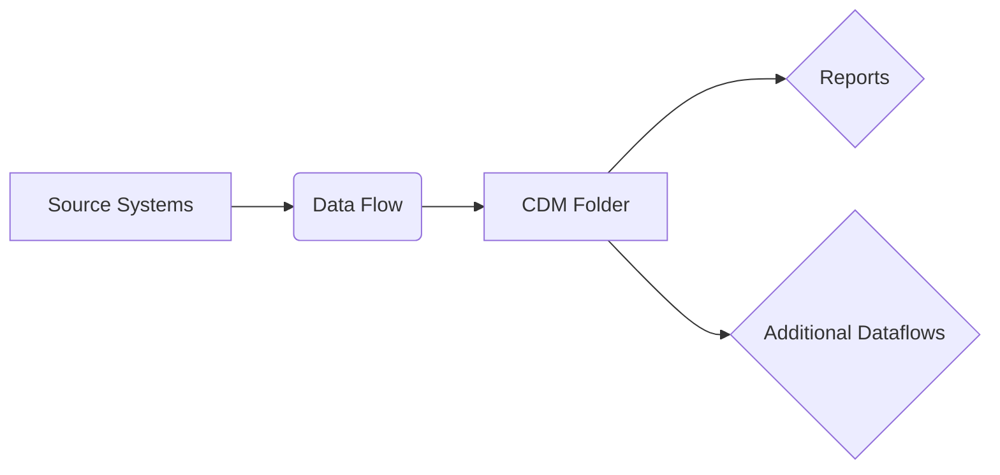

### 7. Data Flows

**Q: What are Power BI data flows and when should they be used?A:** Cloud-based ETL solution:

Use cases:

- Centralized transformation logic
- Reusable across workspaces
- Scheduled refreshes independent of reports
- Premium capacity required
