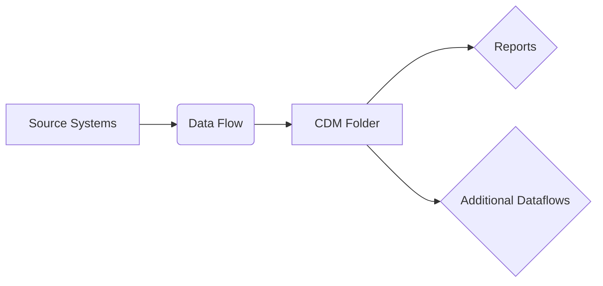

  

### 1. Data Type Identification

**Q: How does Power BI identify country columns as geographic data types?A:** Power BI uses Data Categories to interpret geographic data:

1. Right-click column → "Data Category" → Select "Country"
2. Enables map visualizations and geospatial analysis
3. Works with related categories (State, City, Postal Code)
4. Behind the scenes: Integrates with Bing Maps for coordinates

### 2. Data Compression

**Q: How can Power BI compress a 1GB+ file to under 1GB?A:** Through VertiPaq engine optimization:

```Plain
// Optimization techniques:
= Table.TransformColumns(
    Source,
    {{"DateTimeColumn", DateTime.Date}},  // Split datetime
    {{"TextColumn", each Text.Start(_,5)}})  // Reduce text length
```

Key methods:

- Columnar compression (7-10x typical reduction)
- Value encoding for text categories
- Date/time separation
- Decimal precision reduction

### 3. Power BI Architecture

**Q: Explain Power BI's technical architectureA:** Four-layer architecture:

1. **Data Layer**:
    - Power Query (M language)
    - Source connectors (600+)
    - Gateway for on-premises
2. **Model Layer**:
    - VertiPaq columnar store
    - DAX formula engine
    - Dual storage modes
3. **Visualization Layer**:
    - SVG-based rendering
    - Custom visuals framework
    - Bookmarking system
4. **Service Layer**:
    - [PowerBI.com](http://powerbi.com/) SaaS
    - Capacity-based scaling
    - REST APIs for embedding

### 4. Data Flows

**Q: What are Power BI data flows and when should they be used?A:** Cloud-based ETL solution:



Use cases:

- Centralized transformation logic
- Reusable across workspaces
- Scheduled refreshes independent of reports
- Premium capacity required

### 5. Calculation Engines

**Q: What engines power Power BI's computations?A:** Dual-engine architecture:

- **VertiPaq** (Import mode):
    - Columnar storage
    - Advanced compression
    - 10-100x faster than DirectQuery
- **DirectQuery**:
    - Pass-through to source
    - SQL Server, Snowflake, etc.
    - Real-time data

### 6. Advanced Visualization

**Q: How do you create an effective multi-line chart?A:** Best practices:

```Plain
// Dynamic measure example:
Sales Trend =
VAR TimePeriod = SELECTEDVALUE(Dates[FiscalQuarter])
RETURN
    SWITCH(
        TimePeriod,
        "Q1", [Q1 Sales],
        "Q2", [Q2 Sales],
        [Total Sales]
    )
```

Chart configuration:

- Max 5-7 lines for readability
- Use contrasting colors
- Add trend markers
- Enable cross-filtering

### 7. Security Implementation

**Q: How would you implement RLS for a multinational company?A:** Dynamic RLS pattern:

```Plain
[Region Access] =
VAR UserRegion = LOOKUPVALUE(
    SecurityTable[Region],
    SecurityTable[UserID], USERNAME()
)
RETURN
    CONTAINSSTRING(
        CONCATENATEX(RELATEDTABLE(UserRegions), [Region], ","),
        UserRegion
    )
```

Testing methodology:

1. Create test roles
2. Use "View as Roles" feature
3. Validate with DAX Studio queries

### 8. Performance Optimization

**Q: Your report is slow - how would you troubleshoot?A:** Systematic approach:

**Diagnostic Tools:**

1. Performance Analyzer
2. DAX Studio (server timings)
3. VertiPaq Analyzer

**Common Fixes:**

```Plain
// Power Query optimization
= Table.Buffer( // Manual buffering
    Table.FirstN(
        Table.Sort(Source, {"Sales", Order.Descending}),
        1000) // Top N rows
```

### 9. Data Modeling

**Q: Compare star vs snowflake schemasA:** Technical comparison:

|   |   |   |
|---|---|---|
|Characteristic|Star Schema|Snowflake Schema|
|Dimensions|Denormalized|Normalized|
|Relationships|Simple|Complex|
|Query Speed|Faster|Slower|
|Storage|More redundant|Optimized|
|Maintenance|Easier|Harder|

**When to use snowflake:**

- Very large dimensions (>10M rows)
- Multiple hierarchies
- Slowly changing dimensions

### 10. Advanced Techniques

**Q: How would you handle incremental refresh with historical tracking?A:** Hybrid solution:

```Plain
// Incremental refresh setup
RangeStart = \#datetime(2023,1,1,0,0,0)
RangeEnd = \#datetime(2023,12,31,23,59,59)

// Historical tracking measure
YTD Sales =
VAR CurrentDate = MAX(Sales[Date])
RETURN
    CALCULATE(
        [Total Sales],
        DATESYTD(DimDate[Date]),
        Sales[Date] <= CurrentDate
    )
```

This format provides interviewers with:

1. Clear question presentation
2. Technical depth in answers
3. Practical code examples
4. Visual explanations where helpful
5. Balanced theory and implementation

  

  

### What is Cardinality?

In simple terms, **cardinality refers to the number of unique values in a column.**

It's a measure of the "uniqueness" of the data within a column.

- **Low Cardinality:** A column has low cardinality if it contains very few unique values (e.g., a "Status" column with values like 'Active', 'Inactive', 'Pending').
- **High Cardinality:** A column has high cardinality if it contains many unique values, where each value appears infrequently or only once (e.g., a "Transaction ID" or "Email Address" column).

### Why Cardinality is Extremely Important in Power BI

The Power BI VertiPaq engine, which handles data in Import mode, is a **columnar database**. It achieves its amazing speed and compression by:

1. Creating a dictionary of the unique values for each column.
2. Replacing the actual values in the column with integer pointers to that dictionary.

**Low cardinality is great for this process.** The dictionary is small, and the compression is very effective.**High cardinality is bad for this process.** The dictionary becomes almost as large as the data itself, leading to poor compression, higher memory usage, and slower report performance.

### Illustration with an Example

Let's imagine a `Sales` table with 1 million rows.

|   |   |   |   |   |
|---|---|---|---|---|
|Column Name|Example Values|Cardinality (Approx.)|Type|Impact on Power BI|
|**Gender**|'Male', 'Female'|**2**|**Very Low**|**Excellent:** The engine creates a tiny dictionary. Very fast and highly compressed.|
|**Sales Region**|'North', 'South', 'East', 'West'|**4**|**Very Low**|**Excellent:** Similar to Gender. Ideal for slicers and filters.|
|**Product Category**|'Electronics', 'Clothing', 'Books'...|**50**|**Low**|**Good:** The dictionary is small. Performance is great.|
|**Customer ID**|'CUST-00001', 'CUST-00002'...|**100,000**|**High**|**Poor:** The dictionary is large. This column will use more memory and slow down relationships.|
|**Transaction ID**|'TXN-ABC-123', 'TXN-ABC-124'...|**1,000,000**|**Very High**|**Very Poor:** Every value is unique. The dictionary is as big as the column itself, offering no compression benefit.|
|**Transaction DateTime**|'2023-10-27 09:01:15', '2023-10-27 09:01:18'...|**~1,000,000**|**Very High**|**The Performance Killer:** This is often the worst offender. A DateTime column that includes seconds can be unique for every single row.|

---

### Practical Takeaway and Optimization Tip

A common performance issue in Power BI reports is caused by unintentionally high cardinality columns. The most frequent culprit is a **datetime** column.

**Scenario:** You have a `TransactionDateTime` column like `2023-10-27 09:01:15`. This column has very high cardinality.

**The Solution:**

In Power Query, **split this column into two separate columns:**

1. **Date Column:** e.g., `2023-10-27`. The cardinality of this column will be much lower (only 365 unique values per year).
2. **Time Column:** e.g., `09:01:15`. If you don't need to analyze by time of day, you can even remove this column entirely.

By splitting the column, you replace one very-high-cardinality column with a low-cardinality `Date` column (great for performance) and another column that is either removed or still has high cardinality but is less impactful. This single change can drastically reduce your model size and speed up your report.