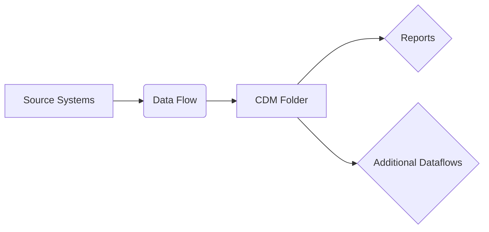

### 1. Data Type Identification

**Q: How does Power BI identify country columns as geographic data types?A:** Power BI uses Data Categories to interpret geographic data:

1. Right-click column → "Data Category" → Select "Country"
2. Enables map visualizations and geospatial analysis
3. Works with related categories (State, City, Postal Code)
4. Behind the scenes: Integrates with Bing Maps for coordinates

### 2. Data Compression

**Q: How can Power BI compress a 1GB+ file to under 1GB?A:** Through VertiPaq engine optimization:

```Plain
// Optimization techniques:
= Table.TransformColumns(
    Source,
    {{"DateTimeColumn", DateTime.Date}},  // Split datetime
    {{"TextColumn", each Text.Start(_,5)}})  // Reduce text length
```

Key methods:

- Columnar compression (7-10x typical reduction)
- Value encoding for text categories
- Date/time separation
- Decimal precision reduction

### 3. Power BI Architecture

**Q: Explain Power BI's technical architectureA:** Four-layer architecture:

1. **Data Layer**:
    - Power Query (M language)
    - Source connectors (600+)
    - Gateway for on-premises
2. **Model Layer**:
    - VertiPaq columnar store
    - DAX formula engine
    - Dual storage modes
3. **Visualization Layer**:
    - SVG-based rendering
    - Custom visuals framework
    - Bookmarking system
4. **Service Layer**:
    - [PowerBI.com](http://powerbi.com/) SaaS
    - Capacity-based scaling
    - REST APIs for embedding

### 4. Data Flows

**Q: What are Power BI data flows and when should they be used?A:** Cloud-based ETL solution:



Use cases:

- Centralized transformation logic
- Reusable across workspaces
- Scheduled refreshes independent of reports
- Premium capacity required

### 5. Calculation Engines

**Q: What engines power Power BI's computations?A:** Dual-engine architecture:

- **VertiPaq** (Import mode):
    - Columnar storage
    - Advanced compression
    - 10-100x faster than DirectQuery
- **DirectQuery**:
    - Pass-through to source
    - SQL Server, Snowflake, etc.
    - Real-time data

### 6. Advanced Visualization

**Q: How do you create an effective multi-line chart?A:** Best practices:

```Plain
// Dynamic measure example:
Sales Trend =
VAR TimePeriod = SELECTEDVALUE(Dates[FiscalQuarter])
RETURN
    SWITCH(
        TimePeriod,
        "Q1", [Q1 Sales],
        "Q2", [Q2 Sales],
        [Total Sales]
    )
```

Chart configuration:

- Max 5-7 lines for readability
- Use contrasting colors
- Add trend markers
- Enable cross-filtering

### 7. Security Implementation

**Q: How would you implement RLS for a multinational company?A:** Dynamic RLS pattern:

```Plain
[Region Access] =
VAR UserRegion = LOOKUPVALUE(
    SecurityTable[Region],
    SecurityTable[UserID], USERNAME()
)
RETURN
    CONTAINSSTRING(
        CONCATENATEX(RELATEDTABLE(UserRegions), [Region], ","),
        UserRegion
    )
```

Testing methodology:

1. Create test roles
2. Use "View as Roles" feature
3. Validate with DAX Studio queries

### 8. Performance Optimization

**Q: Your report is slow - how would you troubleshoot?A:** Systematic approach:

**Diagnostic Tools:**

1. Performance Analyzer
2. DAX Studio (server timings)
3. VertiPaq Analyzer

**Common Fixes:**

```Plain
// Power Query optimization
= Table.Buffer( // Manual buffering
    Table.FirstN(
        Table.Sort(Source, {"Sales", Order.Descending}),
        1000) // Top N rows
```

### 9. Data Modeling

**Q: Compare star vs snowflake schemasA:** Technical comparison:

|   |   |   |
|---|---|---|
|Characteristic|Star Schema|Snowflake Schema|
|Dimensions|Denormalized|Normalized|
|Relationships|Simple|Complex|
|Query Speed|Faster|Slower|
|Storage|More redundant|Optimized|
|Maintenance|Easier|Harder|

**When to use snowflake:**

- Very large dimensions (>10M rows)
- Multiple hierarchies
- Slowly changing dimensions


  

  
